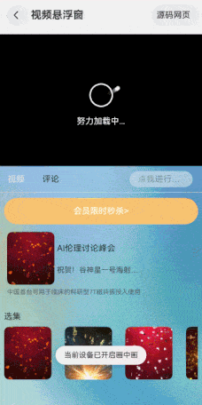

# 视频悬浮窗

### 介绍

本示例主要介绍视频小窗口播放场景，利用媒体的AVPlayer实现视频播放以及相关操作，利用PiPWindow开启悬浮窗从而实现小窗口播放视频。

### 效果图预览



**使用说明**

1. 等待视频加载完成，视频会自动播放。
2. 将应用隐藏到后台，自动拉起悬浮窗继续播放视频。
3. 点击悬浮窗恢复图标，恢复到原始播放界面，视频继续正常播放。
4. 原始播放界面视频暂停不会拉起悬浮窗。
5. 悬浮窗视频暂停后，再点击恢复图标，原始播放界面视频继续播放。
6. 悬浮窗点击关闭之后，原始播放界面视频暂停。
7. 点击原视频界面小窗口图标，可开启悬浮窗。
8. 手指在原视频左侧滑动可改变视频页面的亮度（需真机验证）。
9. 手指在原视频右侧滑动可改变视频的声音（需真机验证，注：本案例使用的视频暂无声音，开发者可更换视频资源验证该功能）。

### 下载安装

1. 模块oh-package.json5文件中引入依赖

   ```json5
   "dependencies": {
     "@ohos/compressfile": "har包地址"
   }
   ```

2. ets文件import自定义视图实视频悬浮窗组件

   ```ts
   import { PipWindowComponent } from '@ohos/pipwindow';
   ```

### 快速使用

本节主要介绍了如何快速上手使用视频悬浮窗组件，包括调节视频亮度声音控制器组件以及常见自定义参数的初始化。

1. 构建组件

   在代码合适的位置使用PipWindowComponent组件并传入对应的参数，后续将介绍对应参数的初始化。

   ```ts
   /**
    * 画中画控制开启、播放组件
    * player:初始化视频播放控制器
    * url:传入在线视频资源
    */
   PipWindowComponent({
     player: this.player,
     url: this.url
   })
   ```

2. 各参数初始化，player可直接写PipManager.getInstance().player，url必须为在线mp4视频。

   ```ts
   @State player: AVPlayer = PipManager.getInstance().player; // 初始化视频播放控制器
   @State url: string = " "; // 传入在线视频资源
   ```

### 属性(接口)说明

PipWindowComponent组件属性

| 属性              | 类型   | 释义                                            | 默认值 |
| ----------------- | ------ | ----------------------------------------------- | ------ |
| player    | AVPlayer | 初始化视频播放控制器                         | -      |
| url   | string | 传入在线视频资源                        | -      |


### 实现思路

本例涉及的关键特性和实现方案如下：

1. 使用媒体的AVPlayer实现视频播放，源码参考[AVPlayer.ets](./src/main/ets/model/AVPlayer.ets)。

```typescript
/**
 * 初始化AVPlayer
 * @param url 在线视频路径
 * @returns 返回值将在线视频进行绑定
 */
async init(url: string): Promise<void> {
  await this.release();
  // 创建avPlayer实例对象
  this.avPlayer = await media.createAVPlayer();
  this.isCreate = true;
  // 创建状态机变化回调函数
  await this.setSourceInfo(); // 视频信息上报函数
  await this.setStateChangeCallback(); // 状态机上报回调函数
  this.avPlayer.url = url; // 播放hls网络直播码流
}
```

2. 使用PiPWindow开启悬浮窗从而实现小窗口播放视频，源码参考[PipManager.ets](./src/main/ets/model/PipManager.ets)。

```typescript
/**
 * 创建画中画控制器，注册生命周期事件以及控制事件回调
 * @param ctx 上下文环境
 */
init(ctx: Context) {
  if (this.pipController !== null && this.pipController !== undefined) {
    return;
  }
  // 当前设备如若不支持画中画则退出
  if (!PiPWindow.isPiPEnabled()) {
    return;
  }

  let config: PiPWindow.PiPConfiguration = {
    context: ctx,
    // XComponent组件绑定同一个
    componentController: this.getXComponentController(),
    // 画中画媒体类型枚举，当前使用的视频播放模版
    templateType: PiPWindow.PiPTemplateType.VIDEO_PLAY,
  };
  // 通过create接口创建画中画控制器实例
  let promise: Promise<PiPWindow.PiPController> = PiPWindow.create(config);
  promise.then((controller: PiPWindow.PiPController) => {
    this.pipController = controller;
    // 通过画中画控制器实例的setAutoStartEnabled接口设置是否需要在应用返回桌面时自动启动画中画
    this.pipController?.setAutoStartEnabled(true);
    // 通过画中画控制器实例的on('stateChange')接口注册生命周期事件回调
    this.pipController.on('stateChange', (state: PiPWindow.PiPState, reason: string) => {
      this.onStateChange(state, reason);
    });
    // 通过画中画控制器实例的on('controlEvent')接口注册控制事件回调
    this.pipController.on('controlEvent', (control: PiPWindow.ControlEventParam) => {
      this.onActionEvent(control);
    });
  }).catch((err: BusinessError) => {
    console.error(`Failed to create pip controller. Cause:${err.code}, message:${err.message}`);
  });
}
```

3. 通过绑定同一个XComponent控制器使得视频页面和悬浮窗页面视频保持统一播放进度，源码参考[XComponentView.ets](./src/main/ets/components/XComponentView.ets)。

```typescript
XComponent({
  type: XComponentType.SURFACE,
  controller: PipManager.getInstance().getXComponentController()
})
  .onLoad(() => {
    // 将surfaceId设置给媒体源
    PipManager.getInstance()
      .getXComponentController()
      .onSurfaceCreated(PipManager.getInstance().getXComponentController().getXComponentSurfaceId())
    // 初始化AVPlayer
    PipManager.getInstance().player.init(this.url);
  })
```

4. 使用@Watch监听AVPlayer的发生变化时，会触发onPlayingChange的回调方法。组件中需要手动控制视频的播放与暂停，因为视频的播放状态是需要根据视频加载进度和手动控制来改变的，所以可以使用@Watch进行监听，源码参考[PipWindowComponent.ets](./src/main/ets/components/PipWindowComponent.ets)。

```typescript
@ObjectLink @Watch("onPlayingChange") player: AVPlayer

onPlayingChange() {
  this.player.isPlaying ? this.player.getPlay() : this.player.getPause();
  if (this.player.isPlaying === false) {
    PipManager.getInstance().setAutoStart(false)
  } else {
    PipManager.getInstance().setAutoStart(true)
    PipManager.getInstance().updatePiPControlStatus()
  }
}
```

5. 悬浮窗的从小窗口恢复到原始播放界面以及关闭悬浮窗，需要通过相关生命周期来进行控制视频的播放状态，源码参考[PipManager.ets](./src/main/ets/model/PipManager.ets)。

```typescript
// 监听画中画生命周期
onStateChange(state: PiPWindow.PiPState, reason: string) {
  switch (state) {
  // 表示画中画将要启动
    case PiPWindow.PiPState.ABOUT_TO_START:
      break;
  // 表示画中画已经启动
    case PiPWindow.PiPState.STARTED:
      // 启动画中画
      PipManager.getInstance().player.isPiPWindowLoad = true;
      break;
  // 表示画中画将要停止
    case PiPWindow.PiPState.ABOUT_TO_STOP:
      // 画中画关闭
      PipManager.getInstance().player.isPiPWindowLoad = false;
      break;
  // 表示画中画已经停止
    case PiPWindow.PiPState.STOPPED:
      // 画中画关闭
      PipManager.getInstance().player.isPiPWindowLoad = false;
      // 小窗口点击关闭画中画，视频暂停播放
      if (!PipManager.getInstance().player.isPiPWindowRestore) {
        PipManager.getInstance().player.isPlaying = false;
      }
      PipManager.getInstance().player.isPiPWindowRestore = false;
      break;
  // 表示画中画将从小窗播放恢复到原始播放界面
    case PiPWindow.PiPState.ABOUT_TO_RESTORE:
      // 小窗口复原关闭画中画
      PipManager.getInstance().player.isPiPWindowLoad = false;
      // 从小窗口复原
      PipManager.getInstance().player.isPiPWindowRestore = true;
      if (!PipManager.getInstance().player.isPlaying) {
        PipManager.getInstance().player.isPlaying = true;
      }
      break;
  // 表示画中画生命周期执行过程出现了异常
    case PiPWindow.PiPState.ERROR:
      break;
    default:
      break;
  }
}
```
6. 因为当悬浮窗的从小窗口恢复到原始播放界面以及关闭悬浮窗时对视频播放状态进行操作，悬浮窗的播放图标并不会实时更新，所以手动进行更新，源码参考[PipManager.ets](./src/main/ets/model/PipManager.ets)。

```typescript
/**
 * 视频播放页面
 * @param url:视频源（本案例仅支持使用在线视频）
 */
XComponentView({
  url: this.url
})
  .gesture(
    // 双击视频，视频暂停/播放
    GestureGroup(GestureMode.Exclusive,
      TapGesture({ count: TAP_GESTURE }).onAction((event?: GestureEvent) => {
        PipManager.getInstance().player.isPlaying = !PipManager.getInstance().player.isPlaying
        if (PipManager.getInstance().player.isPlaying === false) {
          PipManager.getInstance().setAutoStart(false)
          PipManager.getInstance().updatePiPControlStatus()
        } else {
          PipManager.getInstance().setAutoStart(true)
          PipManager.getInstance().updatePiPControlStatus()
        }
      })
    ))
// 更新画中画面板控件状态
updatePiPControlStatus() {
  let controlType: PiPWindow.PiPControlType = PiPWindow.PiPControlType.VIDEO_PLAY_PAUSE; // 视频播放控制面板中播放/暂停控件。
  let status: PiPWindow.PiPControlStatus = PiPWindow.PiPControlStatus.PLAY; // 视频播放控制面板中播放/暂停控件为播放状态。
  this.pipController?.updatePiPControlStatus(controlType, status); // 更新控制面板控件功能状态
}
```
7. 使用onAreaChange来获取原视频页面的播放区域宽高，源码参考[PipWindowComponent.ets](./src/main/ets/components/PipWindowComponent.ets)。

```typescript
Stack(this.player.isLoading ? { alignContent: Alignment.Center } :
  { alignContent: Alignment.Bottom }) {

  /**
   * 视频播放组件
   * url:视频源（本案例仅支持使用在线视频）
   */
  XComponentView({
    url: this.url
  })
    ...
}
.onAreaChange((oldVal: Area, newVal: Area) => {
  // 获取视频播放区域的宽高
  this.videoAreaWidth = newVal.width as number;
  this.videoAreaHeight = newVal.height as number;
})
```
8. 使用PanGesture来确定手指滑动的方向以及移动的距离从而改变实时改变视频的亮度和声音，源码参考[PipWindowComponent.ets](./src/main/ets/components/PipWindowComponent.ets)。

```typescript
Stack(this.player.isLoading ? { alignContent: Alignment.Center } :
  { alignContent: Alignment.Bottom }) {

  /**
   * 视频播放组件
   * url:视频源（本案例仅支持使用在线视频）
   */
  XComponentView({
    url: this.url
  })
    ...
}
  .gesture(
   // 双击视频，视频暂停/播放
   GestureGroup(GestureMode.Exclusive,
      TapGesture({ count: TAP_GESTURE })
         .onAction((event?: GestureEvent) => {
            this.player.isPlaying = !this.player.isPlaying;
            AppStorage.setOrCreate('pipWindow_isPlaying', this.player.isPlaying);
            if (this.player.isPlaying === false) {
               PipManager.getInstance().setAutoStart(false);
               PipManager.getInstance().updatePiPControlStatus();
            } else {
               PipManager.getInstance().setAutoStart(true);
               PipManager.getInstance().updatePiPControlStatus();
            }
         }),
      PanGesture(this.panOption)
         .onActionStart((event: GestureEvent) => {
            this.sysVolumeChange();
            this.positionH = event.offsetY;
            this.controlShow = true;
         })
         .onActionUpdate((event: GestureEvent) => {
            this.panOption.setDirection(PanDirection.Vertical);
            // 手指初次滑动横向坐标位置
            this.fingerPosition = event.fingerList[0].localX;
            if (this.positionH === event.offsetY) {
               return;
            }
            // 手指移动的距离
            let changeVolume = ((this.positionH - event.offsetY) / this.videoAreaHeight) * HEIGHT_INTEGER;
            if (this.fingerPosition < (this.videoAreaWidth / PARTITION)) {
               this.onBrightActionUpdate(changeVolume);
               // 调节视频亮度
               this.mWindow?.setWindowBrightness(this.bright / CONTROLLER_MAX);
            } else {
               this.onVolumeActionUpdate(changeVolume);
            }
            this.positionH = event.offsetY;
         })
         .onActionEnd(() => {
            // 延时隐藏控制器
            setTimeout(() => {
               this.controlShow = false;
            }, CONTROLLER_DElAY)
         })
    ))
```

### 工程结构&模块类型

   ```
pipwindow                                   // har类型
|---components
|   |---ControlPanel.ets                    // 组件层-视频亮度、音量控制器
|   |---PipWindowView.ets                   // 组件层-应用主页面
|   |---PipWindowComponent.ets              // 组件层-视频悬浮穿页面
|   |---VideoInfoComponent.ets              // 组件层-视频详情介绍页面
|   |---XComponentView.ets                  // 组件层-视频播放组件
|---model 
|   |---AVPlayer.ets                        // 模型层-媒体相关操作基本实现
|   |---PipManager.ets                      // 模型层-画中画相关操作基本实现
|---util
|   |---Logger.ets                          // 日志
|   |---TimeTools.ets                       // 时间轴组件页面
   ```

### 模块依赖

[@ohos/routermodule(动态路由)](../../common/routermodule)

### 参考资料

- [XComponent](https://developer.huawei.com/consumer/cn/doc/harmonyos-references-V5/ts-basic-components-xcomponent-V5)
- [媒体服务](https://developer.huawei.com/consumer/cn/doc/harmonyos-references-V5/js-apis-media-V5)
- [画中画窗口](https://developer.huawei.com/consumer/cn/doc/harmonyos-references-V5/js-apis-pipwindow-V5)